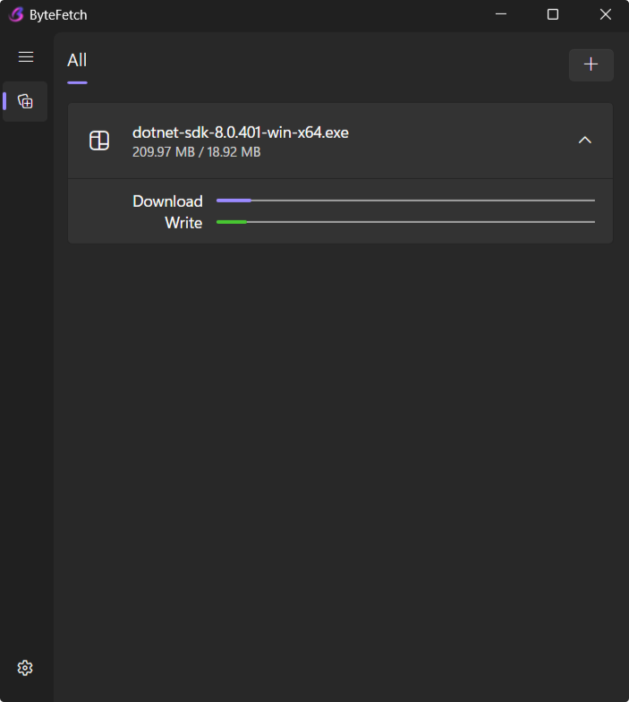

# 📥 ByteFetch - A HTTP Download Manager

ByteFetch is a cross-platform HTTP download manager written in C#.

> **Note:** This is a concept version and may have issues. It is not yet recommended for large file downloads.
